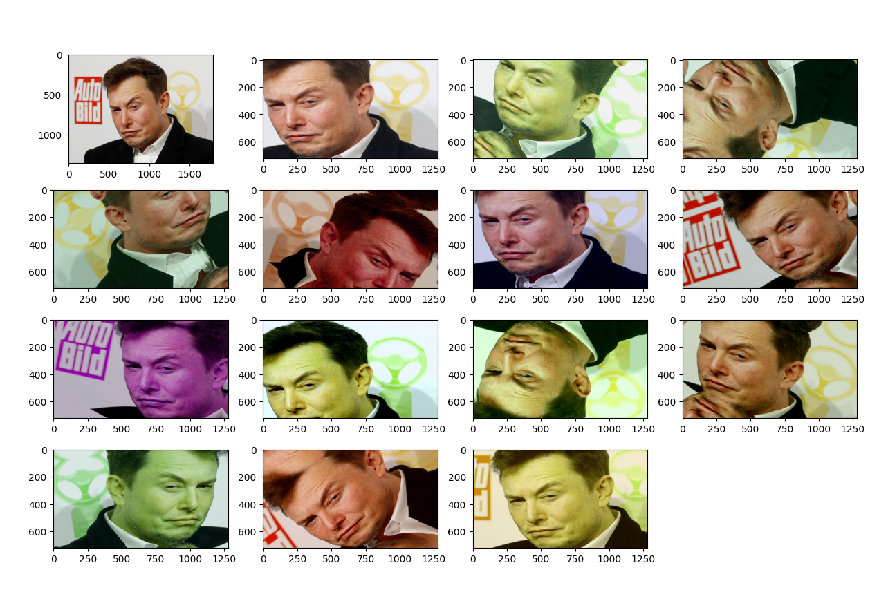
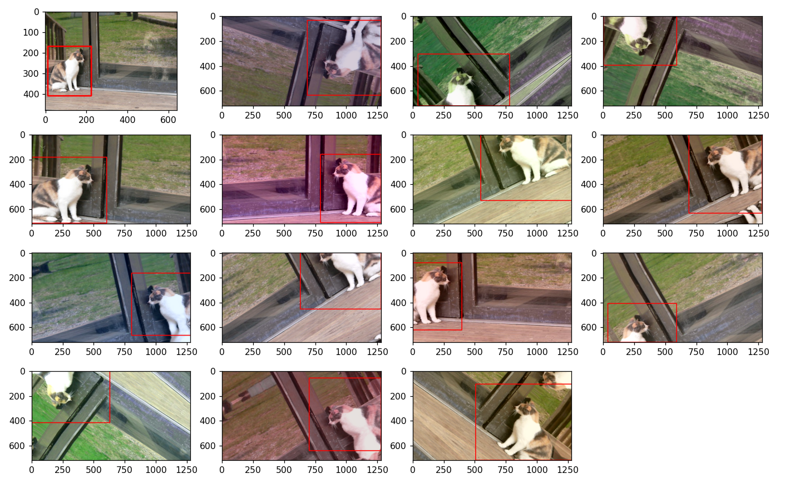
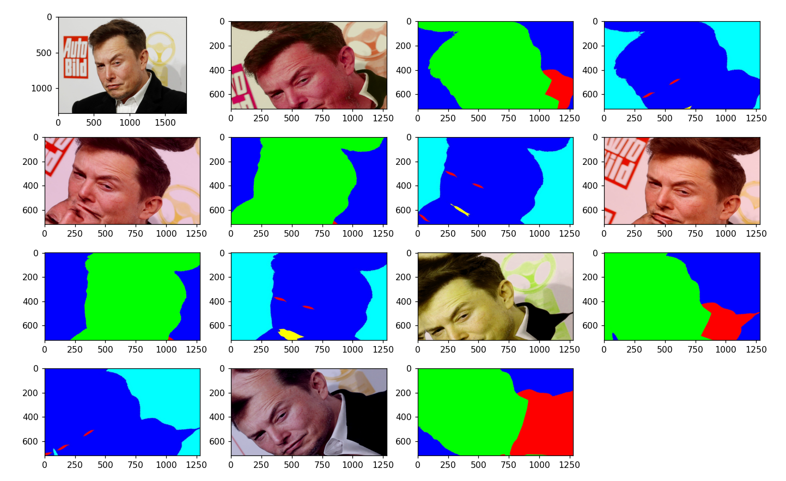
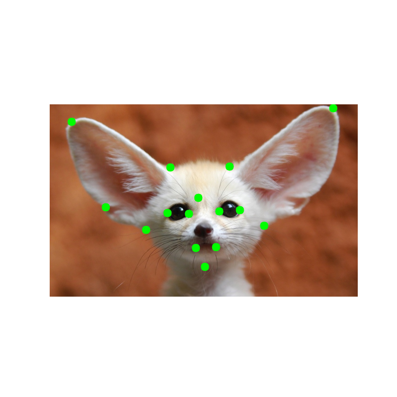
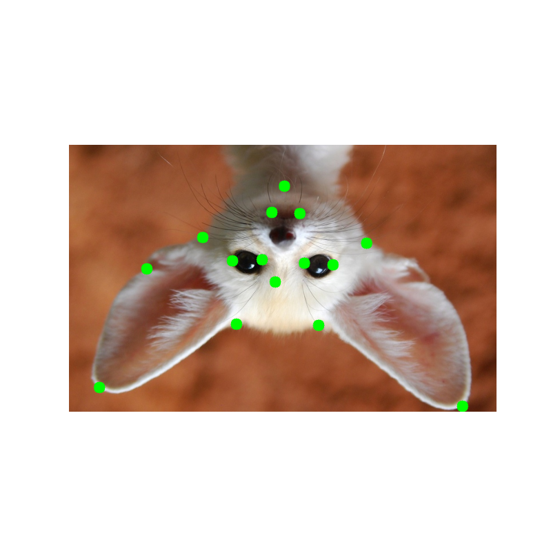
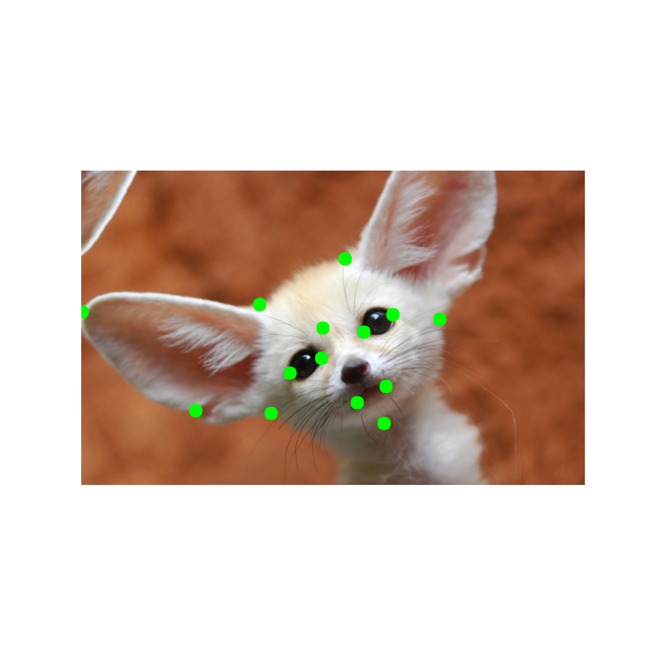

<!--ts-->
   * [Albumenation](#albumenation)
      * [Classification](#classification)
      * [Detection](#detection)
      * [Segmentation](#segmentation)
      * [Keypoints](#keypoints)
      * [Reference](#reference)

<!-- Added by: gil_diy, at: Sat 18 Dec 2021 10:59:16 IST -->

<!--te-->

# Albumenation

## Classification

 <!-- style="width:400px;" -->
  

## Detection 

 <!-- style="width:400px;" -->
  

## Segmentation

 <!-- style="width:400px;" -->
  

## Keypoints

 <!-- style="width:400px;" -->
  

 <!-- style="width:400px;" -->
  

 <!-- style="width:400px;" -->
  

 <!-- style="width:400px;" -->
  

## Reference

[Link](https://albumentations.ai/docs/getting_started/image_augmentation/)